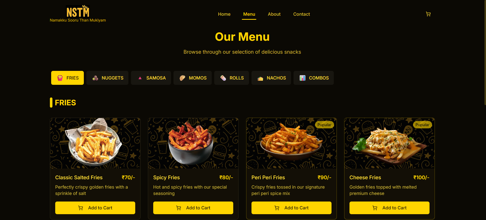
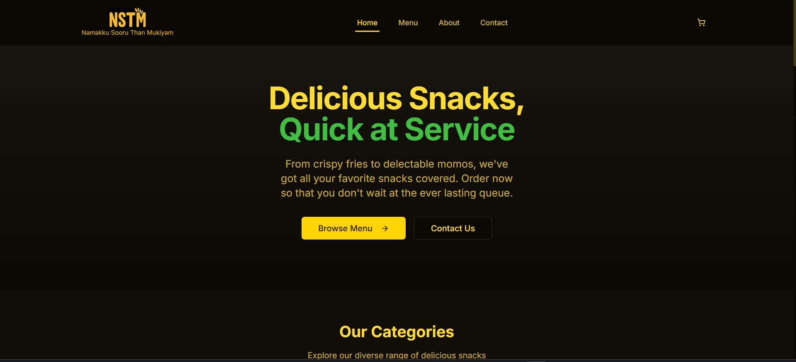

# 🍽️ nstm.food

Welcome to **nstm.food** — a simple, elegant website dedicated to all things food! This project is hosted on GitHub Pages and showcases delicious content, recipes, or services related to food and dining.

## 🌐 Live Website

👉 Visit {nstm.food}




## 🚀 Getting Started

To run the project locally:

```bash
git clone https://github.com/<your-username>/nstm.food.git
cd nstm.food
